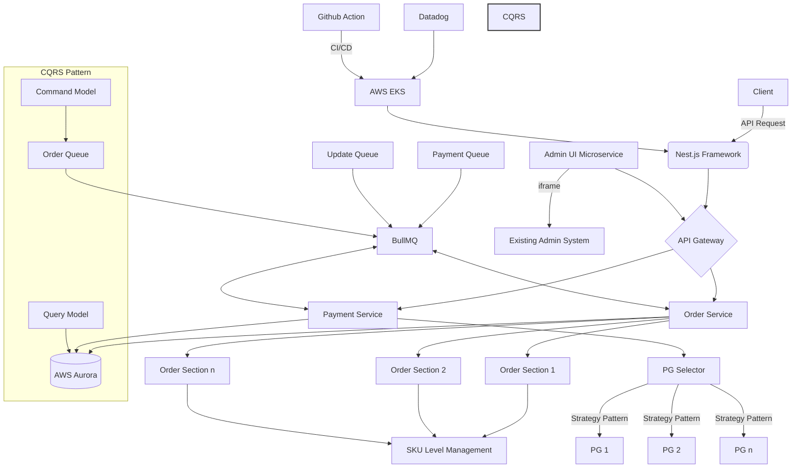

# OPMS - Order/Payment Management System

## Project Overview
Developed a modern order and payment system to address critical issues in the existing monolithic system, such as legacy problems and duplicate order numbers during high-traffic events. The new system improved stability, scalability, and flexibility in order processing and payment management.

---
This is Order Detail in Admin Dashboard

## Architecture

## Key Features
- Multi-PG support for a single store (configurable by ratio)
- Order sectioning with individual item state management
- SKU-level order flow redesign
- Complex payment methods (mixed payments, split payments)
- Separate shipping destinations for order sections
- Admin UI for adding new products and requesting payments within order subsections

## Technical Implementation
- Utilized Nest.js framework for AOP (Aspect-Oriented Programming) capabilities
- Implemented TypeScript, AWS EKS, AWS Aurora, and BullMQ
- Established git-flow policy with automatic deployment
- CI/CD: Jest, Github Action
- Infrastructure: AWS (EKS, ECR, Aurora 3 Serverless, Elasticache, S3, ALB, CloudFront)
- Integrated Datadog for monitoring
- Collaborated with Data Analysts and DBAs for analytics-friendly schema design
- Applied state concept for cascading order data changes
- Implemented CQRS pattern using BullMQ

## Achievements
- Improved SLA from 96% to 99.9819% for 4.5m+ MAU
- Enhanced stability: prevented order number duplication and improved server scalability
- Streamlined deployment process: from manual rsync to Docker Image simultaneous deployment with Blue-Green capability
- Enabled EKS monitoring for better deployment tracking
- Improved maintainability through service logic separation
- Solved real-world operational issues for brands with complex return, refund, and reorder processes
- Implemented order state detection for data change logging

## Technologies Used
- Nest.js, TypeScript
- AWS Services (EKS, Aurora, etc.)
- BullMQ, Docker
- Jest, Github Action
- Datadog
